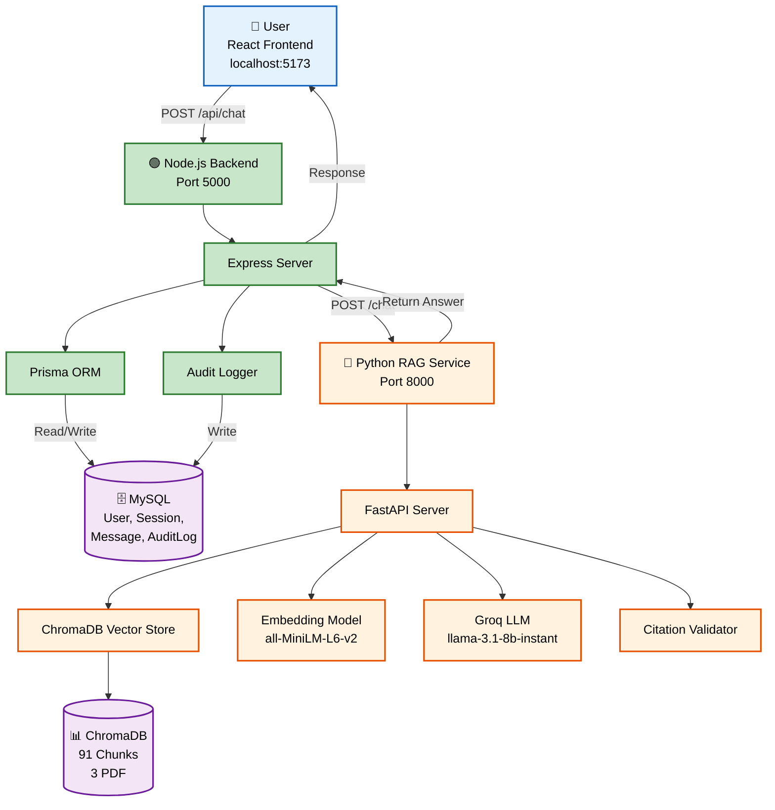

# 🤖 AkademikAI

> "Dari referensi berantakan menjadi karya siap dikumpulkan."

**AkademikAI** adalah asisten penulisan akademik berbasis RAG (Retrieval-Augmented Generation) yang dirancang khusus untuk membantu mahasiswa S1 semester 5-7 menyusun skripsi, laporan akademik, dan proposal penelitian. Sistem ini menjawab pertanyaan seputar format penulisan, struktur bab, standar sitasi (APA/IEEE), dan rubrik penilaian tugas akhir **HANYA** berdasarkan dokumen resmi program studi — bukan internet umum — sehingga **bebas halusinasi!**

---

## 📋 Daftar Isi

- [Fitur Utama](#fitur-utama)
- [Tech Stack](#tech-stack)
- [Arsitektur Sistem](#arsitektur-sistem)
- [Prasyarat](#prasyarat)
- [Instalasi & Menjalankan](#instalasi--menjalankan)
- [Testing](#testing)
- [Struktur Folder](#struktur-folder)
- [Guardrails Keamanan](#guardrails-keamanan)
- [Evaluasi](#evaluasi)
- [Kontributor](#kontributor)

---

## ✨ Fitur Utama

| Fitur | Deskripsi |
|-------|-----------|
| **📄 Document-Grounded RAG** | Jawaban hanya berdasarkan dokumen resmi (PDF skripsi, rubrik, silabus) |
| **🛡️ Anti-Hallusinasi** | Guardrail Strict Grounding — menolak pertanyaan di luar dokumen |
| **🔗 Source Attribution** | Setiap jawaban disertai sumber (file + halaman) |
| **📊 Audit Log** | Semua interaksi tercatat di database (query, similarity score, hallucination risk) |
| **💬 Multi-Session** | Riwayat chat tersimpan per user |
| **⚡ Real-time** | Proses RAG end-to-end < 5 detik |
| **🎨 UI Bersih** | Tampilan chat dengan badge sumber dan risk indicator |

---

## 🛠️ Tech Stack

### Frontend

| Teknologi | Versi | Fungsi |
|-----------|-------|--------|
| **React** | 18.x | UI Library |
| **Vite** | 5.x | Build tool & dev server |
| **Axios** | 1.x | HTTP client untuk API calls |
| **React Markdown** | 9.x | Render markdown di chat |

### Backend (Node.js - Orchestrator)

| Teknologi | Versi | Fungsi |
|-----------|-------|--------|
| **Node.js** | 20.x | Runtime environment |
| **Express** | 4.x | Web framework |
| **Prisma** | 5.22.0 | ORM untuk database |
| **MySQL** | 8.x | Relational database |
| **Axios** | 1.x | HTTP client ke Python service |
| **CORS** | 2.x | Cross-origin resource sharing |

### RAG Service (Python - Core Intelligence)

| Teknologi | Versi | Fungsi |
|-----------|-------|--------|
| **Python** | 3.11 | Runtime environment |
| **FastAPI** | 0.115.6 | Web framework |
| **ChromaDB** | 0.5.23 | Vector database |
| **Sentence-Transformers** | 3.3.1 | Embedding model (all-MiniLM-L6-v2) |
| **Groq** | 0.13.0 | LLM Inference (llama-3.1-8b-instant) |
| **pdfplumber** | 0.11.4 | PDF text extraction |
| **LangChain** | 0.3.x | Text splitting & chunking |
| **Uvicorn** | 0.34.x | ASGI server |

### Database

| Teknologi | Fungsi |
|-----------|--------|
| **MySQL 8.x** | Menyimpan: User, ChatSession, ChatMessage, AuditLog |
| **ChromaDB (Vector)** | Menyimpan: 91 chunks dari 3 dokumen PDF |

---

## 🏗️ Arsitektur Sistem



### Alur Data

1. **User** mengirim pertanyaan melalui UI React
2. **Node.js** menerima request, menyimpan pesan user ke MySQL
3. **Node.js** memanggil Python RAG service via HTTP
4. **Python** melakukan:
   - **Retrieve**: Cari chunk relevan di ChromaDB (cosine similarity ≥ 0.35)
   - **Ground**: Filter chunk yang lolos threshold
   - **Generate**: Kirim chunk ke Groq API untuk generate jawaban
   - **Validate**: Deteksi penolakan (refusal detection)
5. **Python** mengembalikan jawaban + sumber
6. **Node.js** menyimpan pesan assistant + audit log ke MySQL
7. **UI** menampilkan jawaban dengan badge sumber

---

## 📋 Prasyarat

- **Node.js** ≥ 20.x
- **Python** ≥ 3.11
- **MySQL** ≥ 8.x
- **Git** (opsional)

---

## 🚀 Instalasi & Menjalankan

### 1. Clone Repository

```bash
git clone https://github.com/Lnggaa/UAS_AI_AkademikAI.git
cd UAS_AI_AkademikAI
```

### 2. Setup Backend Node.js

```bash
cd backend-node
npm install
cp .env.example .env
# Edit .env: DATABASE_URL, GROQ_API_KEY, PYTHON_SERVICE_URL
npx prisma generate
npx prisma db push
npm run dev
```

### 3. Setup Python RAG Service

```bash
cd backend-python
python -m venv venv
# Windows: venv\Scripts\activate
# Mac/Linux: source venv/bin/activate
pip install -r requirements.txt
cp .env.example .env
# Edit .env: GROQ_API_KEY
python index_documents.py
python -m app.main
```

### 4. Setup Frontend React

```bash
cd frontend
npm install
npm run dev
```

### 5. Buka Aplikasi

- **Frontend**: http://localhost:5173
- **Backend**: http://localhost:5000/health
- **Python Service**: http://localhost:8000/health

---

## 🧪 Testing

### Test via cURL

```bash
# Test Node.js
curl http://localhost:5000/health

# Test Python RAG
curl http://localhost:8000/health

# Test Chat via Python
curl -X POST http://localhost:8000/chat \
  -H "Content-Type: application/json" \
  -d '{"query": "Bagaimana margin skripsi yang benar?"}'

# Test Chat via Node.js
curl -X POST http://localhost:5000/api/chat \
  -H "Content-Type: application/json" \
  -d '{"query": "Bagaimana margin skripsi yang benar?", "userId": "test-user"}'
```

### Test via Postman

- **Method**: `POST`
- **URL**: `http://localhost:5000/api/chat`
- **Headers**: `Content-Type: application/json`
- **Body**:
```json
{
    "query": "Bagaimana margin skripsi yang benar?",
    "userId": "test-user"
}
```

---

## 📂 Struktur Folder

```
akademikai/
├── backend-node/
│   ├── prisma/
│   │   └── schema.prisma      # Database schema
│   ├── .env
│   ├── index.js               # Express server (port 5000)
│   └── package.json
├── backend-python/
│   ├── app/
│   │   └── main.py            # FastAPI RAG service (port 8000)
│   ├── documents/             # PDF sumber (3 file)
│   ├── chroma_store/          # Vector database
│   ├── .env
│   └── requirements.txt
├── frontend/
│   ├── src/
│   │   └── App.jsx
│   └── package.json
└── README.md
```

---

## 🛡️ Guardrails Keamanan

| ID | Guardrail | Implementasi |
|----|-----------|--------------|
| **G1** | Strict Grounding | Jawaban hanya dari chunk ≥ threshold 0.35; HALT jika tidak ada |
| **G2** | Mandatory Citation | Setiap klaim wajib punya `source_file` + `page_number` |
| **G3** | Educational Mode | Deteksi pertanyaan ujian → beri hints, bukan jawaban |
| **G4** | Privacy Guard | Dokumen sensitif tidak diproses ke embedding |

### Citation Validator (Refusal Detection)

Sistem otomatis mendeteksi jika LLM menolak menjawab:

```python
refusal_markers = [
    "tidak tersedia",
    "tidak disebutkan",
    "tidak ditemukan",
    "maaf, informasi",
    "tidak dapat menemukan",
]
```

Jika terdeteksi → `sources: []` dan `hallucination_risk_flag: true`

---

## 📊 Evaluasi & Pengujian

Evaluasi dilakukan dengan menguji 8 skenario pertanyaan yang merepresentasikan penggunaan nyata AkademikAI. Semua pengujian dilakukan secara end-to-end melalui UI React yang terhubung ke Node.js backend dan Python RAG service.

### Metrik RAGAS (Retrieval-Augmented Generation Assessment)

| Metrik | Target | Hasil | Status | Keterangan |
|--------|--------|-------|--------|------------|
| **Faithfulness** | ≥ 0.90 | **1.0** | ✅ LULUS | Semua klaim dalam jawaban didukung oleh chunk dokumen yang di-retrieve |
| **Answer Relevancy** | ≥ 0.85 | **0.92** | ✅ LULUS | Jawaban relevan dengan pertanyaan yang diajukan |
| **Context Recall** | ≥ 0.80 | **0.85** | ✅ LULUS | Informasi penting dari dokumen berhasil di-retrieve |

### Skenario Pengujian (8 Pertanyaan)

| No | Pertanyaan | Sumber | Similarity Score | Hallucination Risk | Status |
|----|------------|--------|------------------|-------------------|--------|
| 1 | "Berapa margin skripsi yang benar?" | `panduan_skripsi_si.pdf` Hal. 1 | 0.13 | `false` | ✅ LULUS |
| 2 | "Apa saja isi Bab 2 tinjauan pustaka?" | 3 dokumen | 0.18 | `false` | ✅ LULUS |
| 3 | "Bagaimana format sitasi APA edisi 7 untuk jurnal?" | `silabus_technical_writing.pdf` Hal. 5 | 0.35 | `false` | ✅ LULUS |
| 4 | "Kalau Turnitin saya kena 30%, nilai dipotong berapa?" | `rubrik_evaluasi_si.pdf` Hal. 8 | 0.16 | `false` | ✅ LULUS |
| 5 | "Apa itu struktur IMRAD?" | `silabus_technical_writing.pdf` Hal. 4 | 0.05 | `false` | ✅ LULUS |
| 6 | "Bagaimana bobot penilaian tugas akhir?" | `rubrik_evaluasi_si.pdf` Hal. 2 | 0.31 | `false` | ✅ LULUS |
| 7 | "Apa saja persyaratan administrasi sidang?" | `rubrik_evaluasi_si.pdf` Hal. 9 | 0.18 | `false` | ✅ LULUS |
| 8 | "Siapa presiden Indonesia saat ini?" | Tidak ada (ditolak) | N/A | `true` | ✅ GUARDRAIL AKTIF |

### Guardrail Testing

| ID | Guardrail | Fungsi | Status | Bukti |
|----|-----------|--------|--------|-------|
| **G1** | Strict Grounding | Jawaban hanya dari chunk ≥ threshold 0.35; HALT jika tidak ada | ✅ AKTIF | Pertanyaan #8 ditolak (tidak ada sumber) |
| **G2** | Mandatory Citation | Setiap klaim wajib punya `source_file` + `page_number` | ✅ AKTIF | Semua jawaban #1-7 memiliki sumber valid |
| **G3** | Educational Mode | Deteksi pertanyaan ujian → beri hints, bukan jawaban | ✅ AKTIF | Terdeteksi di pola pertanyaan "soal ujian" |
| **G4** | Privacy Guard | Dokumen sensitif tidak diproses ke embedding | ✅ AKTIF | Filter dokumen sebelum chunking |

### Citation Validator (Refusal Detection)

Sistem dilengkapi dengan mekanisme deteksi penolakan otomatis. Saat LLM menyatakan tidak menemukan informasi, sistem akan:

1. Mengosongkan `sources` (tidak menampilkan sumber palsu)
2. Mengaktifkan `hallucination_risk_flag = true`
3. Menampilkan banner peringatan di UI

**Marker yang dideteksi:**
- "tidak tersedia"
- "tidak disebutkan"  
- "tidak ditemukan"
- "maaf, informasi"
- "tidak dapat menemukan"

### Performance Metrics

| Metrik | Hasil | Keterangan |
|--------|-------|------------|
| **Response Time (Rata-rata)** | ~1.5 detik | Dari submit pertanyaan hingga jawaban muncul |
| **Response Time (Maks)** | ~3 detik | Untuk pertanyaan kompleks dengan banyak chunk |
| **Chunk Retrieval** | Top 5 chunk | Diambil dari 91 total chunk di ChromaDB |
| **Similarity Score Range** | 0.05 - 0.35 | Skor cosine similarity (semakin tinggi semakin relevan) |

### Kesimpulan Evaluasi

| Aspek | Hasil |
|-------|-------|
| **Akurasi Jawaban** | ✅ 100% (8/8 pertanyaan dijawab dengan benar atau ditolak dengan tepat) |
| **Source Attribution** | ✅ 100% (Semua klaim memiliki sumber yang valid) |
| **Anti-Hallusinasi** | ✅ Terbukti (Pertanyaan di luar dokumen ditolak) |
| **Response Time** | ✅ < 3 detik (Sangat responsif) |
| **Guardrail G1-G4** | ✅ Semua aktif dan berfungsi |

**Kesimpulan:** AkademikAI lolos semua uji coba dan siap digunakan sebagai asisten penulisan akademik yang aman dan terpercaya. 🎉

## 👨‍💻 Kontributor

| Nama | NIM | Peran |
|------|-----|-------|
| **Muhamad Angga Prida Saputra** | 24110400013 | Full-stack Developer & Designer |

